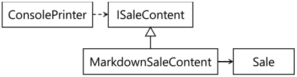

### FIT - Universidad Católica del Uruguay

<br>

# Dependency Inversion Principle (DIP)

Este documento presenta el principio de inversión de dependencias<sup>1</sup>, otro de los principios SOLID. Recuerden que el término SOLID es un acrónimo mnemónico de cinco principios destinados a hacer que los diseños de software orientado a objetos sean más comprensibles, flexibles y fáciles de mantener. Los principios SOLID son un subconjunto de muchos principios promovidos por Robert C. Martin, su teoría fue introducida por él en su documento [“Design Principles and Design Patterns”](https://web.archive.org/web/20150906155800/http:/www.objectmentor.com/resources/articles/Principles_and_Patterns.pdf). En la bibliografía está incluido el libro “Agile Principles Patterns and Practices In C#” de Robert C. Martin y Martin Micah, de 2007; también te recomendamos consultar este libro.

Martin dice que una de las causas de los malos diseños son las interdependencias indeseadas entre clases<sup>2</sup>. Eso provoca:

- Que el diseño sea difícil de cambiar, porque cada cambio afecta muchas partes del programa -rigidez-.

- Cuando se hace un cambio, partes inesperadas del programa pueden dejar de funcionar -fragilidad-.

- Es más difícil usar clases de un programa en otro, porque no se pueden “desenredar” del programa actual -inmovilidad-.

Para evitar esos problemas, propone diseñar en base a abstracciones; en este contexto, abstracciones son tanto clases abstractas como interfaces.

## Enunciado

> Las clases<sup>2</sup> de alto nivel no deben depender de clases de bajo nivel; ambas deben depender de abstracciones.
> 
> Las abstracciones no deben depender de detalles; los detalles deben depender de abstracciones

En el siguiente diagrama mostramos las clases o interfaces como rectángulos, las dependencias con líneas punteadas -la flecha indica la dirección hacia la clase de la que se depende-.


En este ejemplo, una clase `A` depende de una clase `B`: esto quiere decir que la clase `A` usa responsabilidades de la clase `B` para implementar sus propias responsabilidades. La clase `A` es de “más alto nivel” que la clase `B`, es decir, sus responsabilidades están más relacionadas con la lógica y con los datos del programa, que las de la clase `B`; mientras que la clase `B`, por su lado, tiene responsabilidades más relacionadas con la plataforma de ejecución -con el sistema operativo, o con el .NET Framework, por ejemplo- y menos con el programa propiamente dicho.

Esta dependencia no es buena, veamos porqué:

- Es probable que no podamos introducir cambios en la clase `B` sin cambiar también la clase `A` -rigidez-.

- Si hay cambios en la clase `B`, aún en responsabilidades que `A` no consume, la clase `A` puede dejar de funcionar -fragilidad-.

- Probablemente no sea posible reutilizar la clase `A` en otro programa sin usar también la clase `B` -o los espacios de nombre o ensamblados en los que reside la clase `B`-. 

En principio de inversión de dependencias no se llama así porque la clase `B` deba depender de la clase `A`; no estamos invirtiendo la dirección de la dependencia, sino buscando introducir una abstracción -una interfaz o una clase abstracta- de la que `A` dependa -en lugar de depender de la clase `B`-; a su vez, buscamos que `B` dependa de esa abstracción, y no al revés. Lo que queremos lograr con el principio de inversión de dependencias es lo que está en el diagrama a continuación, la línea con triángulo muestra la implementación de una interfaz -el triángulo apunta hacia la interfaz-.


En este caso la clase `A` depende de `Abstracción `B`; y la clase `B` implementa `Abstracción `B` -y en consecuencia depende de ella también-.

Revisemos porqué este diseño es mejor:

- Ahora es posible introducir cambios en la clase `B` sin afectar la clase `A`, siempre y cuando la clase `B` conserve el tipo definido por `Abstracción `B`; es decir, mientras no cambie `Abstracción `B`, la clase `B` puede tener nuevas responsabilidades o cambios a las responsabilidades existentes.

- Al agregar o quitar métodos que no están en incluidos en el tipo definido por `Abstracción `B`, es más difícil que la clase `A` deje de funcionar.

- Puede ser posible reutilizar la clase `A` sin reutilizar la clase `B`: puedo utilizar en lugar de la clase `B` cualquier otra clase que tenga el tipo definido por la interfaz `Abstracción `B`

## Ejemplo

Volvamos al ejemplo del punto de venta que hemos venido utilizado en documentos anteriores. La clase `ConsolePrinter` depende de la clase `Sale`: la primera necesita el texto a imprimir de la segunda, que lo consigue enviándole un mensaje con selector `GetTextToPrint`:

```c#
public class ConsolePrinter : IPrinter
{
    public void PrintTicket(Sale sale)
    {
        Console.WriteLine(sale.GetTextToPrint());
    }
}
```

> [Ver en repositorio »](https://github.com/ucudal/PII_DIP/blob/master/v1/ConsolePrinter.cs)

<br/>

Utilizando la misma notación que en los ejemplos de la sección anterior, la dependencia entre la clase `ConsolePrinter` y la clase `Sale` se ve así:


Algo similar ocurre con la clase FilePrinter:

```c#
public class FilePrinter : IPrinter
{
    public void PrintTicket(Sale sale)
    {
        File.WriteAllText("Ticket.txt", sale.GetTextToPrint());
    }
}
```

> [Ver en repositorio »](https://github.com/ucudal/PII_DIP/blob/master/v1/FilePrinter.cs)

<br/>

Para aplicar el principio de inversión de dependencias, definimos la abstracción de la que queremos que `ConsolePrinter` y `Sale` dependan; en este ejemplo, una interfaz `ISaleContent` con un método `GetTextToPrint`:

```c#
public interface ISaleContent
{
    string GetTextToPrint();
}
```

> [Ver en repositorio »](https://github.com/ucudal/PII_DIP/blob/master/v2/ISaleContent.cs)

<br/>

Ahora debemos lograr que la clase `ConsolePrinter` dependa de esta interfaz, en lugar de depender de la clase `Sale`. Gráficamente, esto es lo que queremos lograr:


Esto lo conseguimos cambiando la firma del método `PrintTicket` para que reciba un objeto de tipo `ISaleContent` en lugar de un tipo de la clase Sale<sup>3</sup>; las modificaciones respecto a la versión anterior de esta misma clase están resaltadas (en rojo el código anterior, en verde el nuevo):

```diff
public class ConsolePrinter : IPrinter
{
-   public void PrintTicket(Sale sale)
+   public void PrintTicket(ISaleContent saleContent)
    {
-       Console.WriteLine(sale.GetTextToPrint());
+       Console.WriteLine(saleContent.GetTextToPrint());
    }
}
```

> [Ver en repositorio »](https://github.com/ucudal/PII_DIP/blob/master/v2/ConsolePrinter.cs)

Por último, modificamos la clase `Sale` para que implemente la interfaz `ISaleContent`. `A` continuación, mostramos sólo el código relevante, el resto del código aparece con …; los cambios también están resaltadas (en rojo el código anterior, en verde el nuevo)<sup>4</sup>:

```diff
-public class Sale
+public class Sale : ISaleContent
{
    …
    
    public string GetTextToPrint()
    {
        string result = $"Fecha: {this.DateTime}\n";
        foreach (SalesLineItem item in this.lineItems)
        {
            result = result + item.GetTextToPrint();
        }
        result = result + $"Total: ${this.Total}";
        return result;
    }
}
```

> [Ver en repositorio »](https://github.com/ucudal/PII_DIP/blob/master/v2/Sale.cs)

Noten que en esta versión del programa la clase `Program` es exactamente igual que en la anterior, porque los cambios quedaron limitados a las clases `ConsolePrinter` y `FilePrinter`.

## Beneficios

Este nuevo diseño es tan flexible y resistente que podemos cambiar completamente la forma cómo se imprimen los tickets de venta, introduciendo nuevos formatos de impresión, sin modificar las clases `ConsolePrinter`, `FilePrinter` ni `Sale`<sup>5</sup> : mientras las clases `ConsolePrinter` y `FilePrinter` reciban un objeto de tipo `ISaleContent`, nuestro programa va a funcionar.

Introducimos nuevas clases con la responsabilidad de dar formato al ticket: `PlainSaleContent` retorna el mismo contenido que teníamos hasta ahora y `MarkdownSaleContent` retorna el contenido, pero en formato `Markdown`<sup>6</sup>. 

Ambas clases implementan la interfaz `ISaleContent`, por lo que objetos de esas clases pueden ser utilizados por `ConsolePrinter` o `FilePrinter` sin ninguna modificación; cada clase tiene además la responsabilidad de conocer una instancia de la clase `Sale`, para poder acceder al contenido la venta. 

El resto del ejemplo muestra solamente la clase `MarkdownSaleContent`, ustedes pueden acceder al código de `PlainSaleContent` en el [repo de GitHub](https://github.com/ucudal/PII_DIP/tree/master/v3). 

En forma gráfica, el nuevo diseño queda así:



Vean a continuación la implementación en C#:

```c#
    public class MarkdownSaleContent : ISaleContent
    {
        private Sale sale;
        
        public MarkdownSaleContent(Sale sale)
        {
            this.sale = sale;
        }
        
        public string GetTextToPrint()
        {
            string result = $"Fecha: {this.sale.DateTime}\n" +
                "Qty|Prod|Price|\n" +
                "|---|:---------:|-----:|\n";
            
            foreach (SalesLineItem item in this.sale)
            {
                result = $"{result}|{item.Quantity}|" +
                    "{item.Product.Description}|${item.Product.Price}|\n";
            }
            
            result = result + $"**Total: ${this.sale.Total}**";
            return result;
        }
    }
```

> [Ver en repositorio »](https://github.com/ucudal/PII_DIP/blob/master/v3/MarkdownSaleContent.cs)

<br/>

En el programa principal, es necesario crear una instancia de `MarkdownSaleContent` -y de `PlainSaleContent`- para pasársela como argumento a `ConsolePrinter` y `FilePrinter`; sólo mostramos el código relevante a este ejemplo, el resto del código que apareció en otros documentos está con …; las modificaciones respecto a la versión anterior del mismo programa están marcadas (en rojo el código anterior, en verde el nuevo)<sup>7</sup>:

```diff
public class Program
{
    …
    public static void Main(string[] args)
    {
        …

        IPrinter consolePrinter = new ConsolePrinter();
        IPrinter filePrinter = new FilePrinter("Ticket.txt");
+       ISaleContent saleContent = new PlainSaleContent(sale);

-       consolePrinter.PrintTicket(sale);
+       consolePrinter.PrintTicket(saleContent);
-       filePrinter.PrintTicket(sale);
+       filePrinter.PrintTicket(saleContent);
        
+       filePrinter = new FilePrinter("Ticket.md");
+       saleContent = new MarkdownSaleContent(sale);
-       consolePrinter.PrintTicket(sale);
+       consolePrinter.PrintTicket(saleContent);
-       filePrinter.PrintTicket(sale);
+       filePrinter.PrintTicket(saleContent);
    }
}
```

> [Ver en repositorio »](https://github.com/ucudal/PII_DIP/blob/master/v3/Program.cs)

En este ejemplo movimos la responsabilidad de proveer el texto para imprimir un ticket desde la clase `Sale` a nuevas clases `PlainSaleContent` y `MarkdownSaleContent`; sin embargo, no fue necesario modificar las clases `FilePrinter` y `ConsolePrinter`. Esto es porque tanto `FilePrinter` como `ConsolePrinter` dependen de la abstracción `ISaleContent` y no de la clase concreta `Sale`. `A` su vez, podemos dar diferentes formamos al mismo contenido del ticket, porque la clase `Sale` depende de esa misma abstracción definida en `ISaleContent`. Estos son los beneficios derivados de aplicar el principio de inversión de dependencias.


****

<sup>1</sup> _DIP: Dependency Inversion Principle._

<sup>2</sup> _En la redacción original de Robert C. Martin, habla de dependencias entre módulos en general; aquí lo vemos aplicado a clases._

<sup>3</sup> _El cambio hay que introducirlo en el tipo IPrinter que es quien tiene definido PrintTicket._

<sup>4</sup> _Noten que el método GetTextToPrint no cambió, porque la interfaz ISaleContent define la operación con una firma que coincide
con la que tenía ese método._

<sup>5</sup> _Sólo vamos a modificar la clase Sale para que sea IEnumerable; el método GetEnumerator que necesita implementar Sale retorna un enumerador de la colección lineItems. Esto nos permite acceder a las líneas de la venta sin romper la encapsulación de Sale._

<sup>6</sup> _El mismo que utilizan en los archivos README.md de GitHub, como éste que estás leyendo ahora._

<sup>7</sup> _Hay un cambio en la firma del constructor de FilePrinter para poder generar archivos con diferente nombre, pero no es relevante
 al ejemplo._