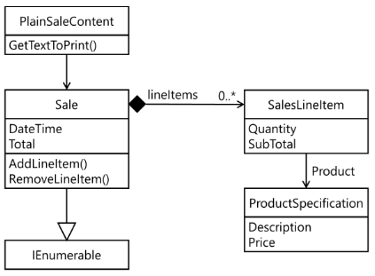

### FIT - Universidad Católica del Uruguay

<br>

# Don't Talk to Strangers (Ley de Demeter)

## Introducción

Este  documento  presenta  otro  de  los  patrones  GRASP<sup>1</sup>.  Recuerden  que  los  patrones  GRASP fueron  planteados  por Craig Larmannen el libro “Applying UML and Patterns”, de 1998. Tanto el patrón presentado en el este documento como el ejemplo que lo acompaña están tomados de ese libro, que te recomendamos consultar. Aunque un objeto esté bien encapsulado, aún es posible conocer detalles de la implementación de ese objeto cuando “navegamos” a través de la estructura de objetos indirectos; esto es, cuando accedemos a atributos o métodos de objetos que son a su vez atributos del objeto en cuestión. Mira por ejemplo el diagrama siguiente, tomado del documento Dependency Inversion Principle:



El código correspondiente a este diagrama aparece a continuación:

```diff
public class PlainSaleContent : ISaleContent
{
    private Sale sale;

    public PlainSaleContent(Sale sale)
    {
        this.sale = sale;
    }

    public string GetTextToPrint()
    {
        string result = $"Fecha: {this.sale.DateTime}\n";
+       foreach (SalesLineItem item in this.sale)
        {
+           result = result + $"{item.Quantity} de '{item.Product.Description}' " +
+               "a ${item.Product.Price}\n";
        }
         result = result + $"Total: ${this.sale.Total}";
        return result;
    }
}
```

> [Ver en repositorio »](https://github.com/ucudal/PII_Demeter/blob/master/v1/PlainSaleContent.cs)

<br/>

La clase `PlainSaleContent` conoce solamente una instancia de `Sale`. Esa clase `Sale` contiene instancias de `SalesLineItem` que están bien encapsuladas: la variable de instancia `lineItems` que referencia la lista de objetos de esa clase es privada y esos objetos son agregados o removidos solamente a través de los métodos `AddLineItem` y `RemoveLineItem`. Sin embargo, a través de la interfaz `IEnumerable` que la clase `Sale` implementa, la clase `PlainSaleContent` puede acceder a las instancias de `SalesLineItem`; y también puede acceder a la instancia de `ProductSpecification` referenciada en la propiedad `Product` de la clase `SalesLineItem`. Los objetos de las clases `SalesLineItem` y `ProductSpecification` son “objetos indirectos” para `PlainSaleContent`, pues directamente sólo conoce objetos de la clase `Sale`. Estas “violaciones” a la ley de Demeter están resaltadas en el ejemplo anterior.

Aunque no hay ninguna violación a la encapsulación en las clases `Sale`, `SalesLineItem` o `ProductSpecification`, la clase `PlainSaleContent` conoce demasiados detalles de la implementación de la clase `Sale`, a través la estructura de objetos indirectos. Los cambios en esta estructura, de la cual la clase `PlainSaleContent` depende, pueden hacer que esta clase deje de funcionar; por eso es deseable evitar depender de la estructura de objetos indirectos.

## Problema

¿Cómo evitar conocer la estructura de objetos indirectos?

Cuando un objeto conoce las conexiones internas y estructura de otros objetos, tiene un acoplamiento alto, que como ya vimos es deseable evitar.

## Solución

Asignar la responsabilidad de colaborar con objetos indirectos de un objeto dado a los objetos directos, para que ese objeto no necesite conocer a los objetos indirectos.

En este contexto, un objeto directo de un objeto dado es:

- El propio objeto `this` en C#.

- Un objeto recibido como argumento en un método del propio objeto.

- Un atributo del propio objeto.

- Un objeto contenido en una colección del propio objeto.

- Un objeto creado dentro de un método.

Los objetos con estas relaciones se consideran “conocidos” del objeto dado y por lo tanto es posible ese objeto les envíe mensajes o acceda a sus atributos, los demás objetos son “extraños” y no deberían ser accedidos; de ahí el nombre del patrón.

Una forma de recorrer una estructura de objetos respetando el patrón Don’t Talk to Strangers es mediante otro de los patrones del catálogo en Design Patterns: Elements of Reusable Object-oriented Software, de Erich Gamma, Richard Helm, Ralph E. Johnson y John Vlissides<sup>2</sup>, llamado Visitor. Este libro está incluido en la bibliografía y te lo recomendamos consultar. También puedes ver el patrón [Visitor en el sitio Refactoring Guru](https://refactoring.guru/design-patterns/visitor).

En este patrón, los objetos en la estructura a recorrer tienen un método `Accept` que recibe como argumento un objeto de tipo `Visitor`; estos métodos `Accept` simplemente delegan la operación a ese objeto, pasándose a sí mismos como argumento de un mensaje con selector `Visit` que todos los objetos de tipo `Visitor` tienen. Vean el código del método `Accept` a continuación para las clases `Sale`, `SalesLineItem` y `ProductSpecification`; sólo mostramos el código nuevo, los … representan el código que ya apareció antes. Las modificaciones están resaltadas.

```diff
public class Sale : IEnumerable
{
    …
+   public void Accept(Visitor visitor)
+   {
+       visitor.Visit(this);
+   }
}
```

> [Ver en repositorio »](https://github.com/ucudal/PII_Demeter/blob/master/v2/Sale.cs)

<br/>

```diff
public class SalesLineItem
{
    …
+   public void Accept(Visitor visitor)
+   {
+       visitor.Visit(this);
+   }
}
```

> [Ver en repositorio »](https://github.com/ucudal/PII_Demeter/blob/master/v2/SalesLineItem.cs)

<br/>

```diff
public class ProductSpecification
{
    …
+   public void Accept(Visitor visitor)
+   {
+       visitor.Visit(this);
+   }
}
```

> [Ver en repositorio »](https://github.com/ucudal/PII_Demeter/blob/master/v2/ProductSpecification.cs)

<br/>

El tipo `Visitor` implementa un método `Visit` para cada tipo en la estructura a recorrer. En el código de ejemplo a continuación, `Visitor` es una clase abstracta que además de los métodos `Visit` para `Sale`, `SalesLineItem` y `ProductSpecification` sugeridos por el patrón, tiene una propiedad `Content` que retorna el texto a imprimir. Como construir el contenido implica manipulación de cadenas de texto, la clase define un objeto de tipo [StringBuilder](https://docs.microsoft.com/en-us/dotnet/api/system.text.stringbuilder?view=netframework-4.7.2 ) en una propiedad protegida llamada `ContentBuilder` que los sucesores concretos pueden utilizar.

```c#
public abstract class Visitor
{
    public string Content
    {
        get
        {
            return this.ContentBuilder.ToString();
        }
    }

    protected StringBuilder ContentBuilder { get; } = new StringBuilder();

    public abstract void Visit(Sale sale);

    public abstract void Visit(SalesLineItem lineItem);

    public abstract void Visit(ProductSpecification product);
}
```

> [Ver en repositorio »](https://github.com/ucudal/PII_Demeter/blob/master/v2/Visitor.cs)

<br/>

Una subclase de `Visitor` llamada `PlainContentVisitor` implementa los métodos `Visit` agregado a la propiedad heredada `Content` texto sin formato, mientras que otra subclase de `Visitor` llamada `MarkdownContentVisitor` implementa esos métodos pero agregando texto con formato Markdown.

```c#
public class PlainContentVisitor : Visitor
{
    public override void Visit(Sale sale)
    {
        this.ContentBuilder.Clear();
        this.ContentBuilder.Append($"Fecha: {sale.DateTime}\n");
        foreach (SalesLineItem item in sale)
        {
            item.Accept(this);
        }

        this.ContentBuilder.Append($"Total: ${sale.Total}");
    }

    public override void Visit(SalesLineItem item)
    {
        this.ContentBuilder.Append($"{item.Quantity} de ");
        item.Product.Accept(this);
    }

    public override void Visit(ProductSpecification product)
    {
        this.ContentBuilder.Append($"'{product.Description}' a ${product.Price}\n");
    }
}
```

> [Ver en repositorio »](https://github.com/ucudal/PII_Demeter/blob/master/v2/PlainContentVisitor.cs)

<br/>

```c#
public class MarkdownContentVisitor : Visitor
{
    public override void Visit(Sale sale)
    {
        this.ContentBuilder.Clear();
        this.ContentBuilder.Append($"Fecha: {sale.DateTime}\n" +
            "Qty|Prod|Price|\n" +
            "|---|:---------:|-----:|\n");

        foreach (SalesLineItem item in sale)
        {
            item.Accept(this);
        }

        this.ContentBuilder.Append($"**Total: ${sale.Total}**");
    }

    public override void Visit(SalesLineItem item)
    {
        this.ContentBuilder.Append($"|{item.Quantity}|");
        item.Product.Accept(this);
    }

    public override void Visit(ProductSpecification product)
    {
        this.ContentBuilder.Append($"{product.Description}|${product.Price}|\n");
    }
}
```

> [Ver en repositorio »](https://github.com/ucudal/PII_Demeter/blob/master/v2/MarkdownContentVisitor.cs)

<br/>

Noten que en estas clases no se “viola” la ley de Demeter, pues cada método `Visit` recibe el objeto con el que interactúa como argumento, y por lo tanto no es un “extraño”.

En los métodos `GetTextToPrint` de las clases `PlainSaleContent` y `MarkdownSaleContent` simplemente se crea una instancia `PlainContentVisit`or o `MarkdownContentVisit`or respectivamente y se recorre la venta; luego se obtiene el contenido resultado de la recorrida con la propiedad Content. Las modificaciones a estas clases aparecen a continuación remarcadas:

```diff
public class PlainSaleContent : ISaleContent
{
    private Sale sale;

    public PlainSaleContent(Sale sale)
    {
        this.sale = sale;
    }

    public string GetTextToPrint()
    {
+       Visitor visitor = new PlainContentVisitor();
+       this.sale.Accept(visitor);
+       return visitor.Content;
    }
}
```

> [Ver en repositorio »](https://github.com/ucudal/PII_Demeter/blob/master/v2/PlainSaleContent.cs)

<br/>

```diff
internal class MarkdownSaleContent : ISaleContent
{
    private Sale sale;

    public MarkdownSaleContent(Sale sale)
    {
        this.sale = sale;
    }

    public string GetTextToPrint()
    {
+       Visitor visitor = new MarkdownContentVisitor();
+       this.sale.Accept(visitor);
+       return visitor.Content;
    }
}
```

> [Ver en repositorio »](https://github.com/ucudal/PII_Demeter/blob/master/v2/MarkdownSaleContent.cs)

<br/>

Este patrón Don’t Talk to Strangers, al igual que los demás, debe ser aplicado con sentido común. Hay veces en las que no está mal acceder a objetos indirectos, todo depende de la complejidad de la estructura de esos objetos y de las dependencias indeseables que se crean. A veces es mejor convivir con eso que introducir un patrón como `Visitor`.

Tengan en cuenta también que el patrón `Visitor` no es la única forma de cumplir con la ley de Demeter, lo incluimos aquí como un ejemplo conveniente.

*****

_<sup>1</sup> General Responsibility Assignment Methods_

_<sup>2</sup> Los patrones Observer y Singleton que ya conocen provienen también de ese catálogo. Vean por ejemplo https://www.oodesign.com/_