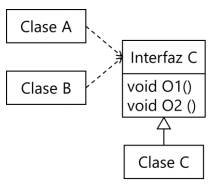
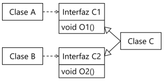
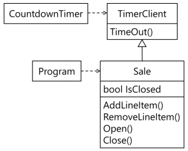
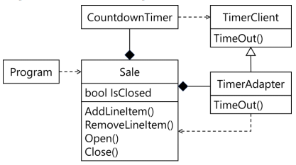

### FIT - Universidad Católica del Uruguay

<br>

# Interface Segregation Principle (ISP)

Hay ocasiones en las cuales una clase expone responsabilidades que no todos los objetos con los que colabora necesitan usar; el tipo definido por la clase tiene siempre más operaciones o propiedades que los objetos con los que colabora usan y necesitan. Cuando vemos esa clase a la luz del principio de responsabilidad única, puede no haber suficientes argumentos para separar las responsabilidades de esa clase en varias. Los objetos que utilizan esa clase tienen una dependencia “todo o nada” aunque usen solo algunas operaciones y propiedades. Y ya vimos antes en el documento del [Principio de Inversión de Dependencias](./DIP.md) algunas razones por las que debemos evitar las dependencias indeseadas. 

Para evitarlo, [Robert C. Martin](https://es.wikipedia.org/wiki/Robert_C._Martin) propone el principio de segregación de interfaces (ISP), otro de los principios SOLID. Recuerden que término SOLID es un acrónimo mnemónico de cinco principios destinados a hacer que los diseños de software orientado a objetos sean más comprensibles, flexibles y fáciles de mantener. Los principios SOLID son un subconjunto de muchos principios promovidos por Robert C. Martin. Su teoría fue introducida por él en su documento [“Design Principles and Design Patterns”](https://web.archive.org/web/20150906155800/http:/www.objectmentor.com/resources/articles/Principles_and_Patterns.pdf). En la bibliografía está incluido el libro “Agile Principles Patterns and Practices In C#” de Robert C. Martin y Martin Micah, de 2007; también te recomendamos consultar este libro.

## Enunciado

> Los clientes no deben ser forzados a depender de tipos<sup>1</sup> que no usan.

En este contexto, un objeto cliente es el objeto que usa responsabilidades -que pide colaboración- a la clase que expone esas responsabilidades mediante un tipo. Recuerden que una clase tiene más de un tipo: tiene el tipo definido por esa clase, más los tipos definidos por todas sus clases ancestras, más los tipos definidos por las interfaces que implementa esa clase y sus clases ancestras.

En el siguiente diagrama mostramos las clases o interfaces como rectángulos, las dependencias con líneas punteadas -la flecha indica la dirección hacia la clase de la que se depende-, la línea con triángulo muestra la implementación de una interfaz -el triángulo apunta hacia la interfaz.-



En este caso las clases `A` y `B` dependen de `Interfaz C`. Esa interfaz define dos responsabilidades de hacer, en las operaciones `O1` y `O2`. Supongan que la clase `A` depende -usa para implementar sus propias responsabilidades- sólo de la operación `O1` y la clase `B` sólo de la operación `O2`. Un cambio en la clase `A` que implique un cambio en la operación `O1`, implica que tengo que modificar también la clase `B` aunque no use la operación `O1`.

Una forma mejor de distribuir las responsabilidades es separar las operaciones `O1` y `O2` en dos tipos -en dos interfaces- diferentes, `Interfaz C1` e `Interfaz C2`:



Con este nuevo diseño, un cambio en `O1` sólo afectará a la clase `A`.

## Ejemplo

Continuamos usando el ejemplo del punto de venta<sup>2</sup> de documentos anteriores. Es común que luego de cerrada una venta no se pueda modificar el ticket. Para ello agregamos en la clase `Sale` una propiedad `IsClosed` y un método `Close` para cerrar la venta. Los métodos `AddLineItem` y `RemoveLineItem` levantan una excepción de tipo `InvalidOperationException` si trato de agregar o quitar líneas al ticket. Vean el código a continuación, sólo incluimos el código relevante, los puntos … representan el resto del código.

```c#
public class Sale
{
    …
    
    public bool IsClosed { get; private set; }
    
    …

    public SalesLineItem AddLineItem(double quantity, ProductSpecification product)
    {
        if (this.IsClosed)
        {
            throw new InvalidOperationException("La venta está cerrada.");
        }
 
        SalesLineItem item = new SalesLineItem(quantity, product);
        this.lineItems.Add(item);
        return item;
    }

    public void RemoveLineItem(SalesLineItem item)
    {
        if (this.IsClosed)
        {
            throw new InvalidOperationException("La venta está cerrada.");
        }
        this.lineItems.Remove(item);
    }
    
    public void Close()
    {
        if (this.IsClosed)
        {
            throw new Exception("La venta ya está cerrada.");
        }
        this.IsClosed = true;
    }
    
    public void Open()
    {
        if (!this.IsClosed)
        {
            throw new Exception("La venta no está cerrada.");
        }
        this.IsClosed = false;
    }

    …
}

```

> [Ver en repositorio »](https://github.com/ucudal/PII_ISP/blob/master/v1/Sale.cs)

<br>

También es bastante común en los puntos de venta que el ticket se cierre automáticamente para evitar modificaciones accidentales si queda abierto más tiempo del necesario. La persona que usa el punto de venta puede abrirlo nuevamente si fue cerrado automáticamente. Para implementar esto contamos con una clase `CountdownTimer` a la que un objeto de tipo `TimerClient` puede registrarse usando el método `Register` para que le avise después de transcurrido cierto tiempo. La clase `CountDowntimer` le avisa al objeto registrado enviándole un mensaje `TimeOut` cuya la firma está definida en `TimerClient`. Vean la interfaz y la clase a continuación:


```c#
public interface TimerClient
{
    void TimeOut();
}

public class CountdownTimer
{
    private TimerClient client;

    private Timer timer;
    
    public void Register(int timeOut, TimerClient client)
    {
        this.client = client;
        this.timer = new Timer(this.OnTimedEvent, null, timeOut, Timeout.Infinite);
    }
    
    private void OnTimedEvent(object state)
    {
        this.client.TimeOut();
        this.timer.Change(Timeout.Infinite, Timeout.Infinite);
    }
}
```

> [Ver en repositorio »](https://github.com/ucudal/PII_ISP/blob/master/v1/CountdownTimer.cs),

<br/>

Para poder cerrar la venta automáticamente luego de transcurrido cierto tiempo, necesitamos registrar la venta con una instancia de `CountdownTimer`, para lo cual la clase Sale debe implementar la interfaz `TimerClient`. En forma gráfica, el diseño queda así:



Noten que la clase `Sale` tiene las mismas operaciones que tenía antes, más un nuevo método `TimeOut`: este nuevo método agregado para implementar la interfaz `TimerClient` no es necesario para usar hacer una venta, sino por el mecanismo de notificación que usa `CountdownTimer`. Por ejemplo, la clase `Program` depende de la clase `Sale` -crea instancias y agrega líneas de venta- y pasa a depender -indirectamente- de la interfaz `TimerClient`.

El código de la clase `Sale` aparece a continuación, los puntos … representan el código que ya apareció antes, las modificaciones están marcadas con el comentario `//nuevo`:

```c#
public class Sale : TimerClient
{
    …
    
    private CountdownTimer timer = new CountdownTimer();   // nuevo

    public Sale()    // nuevo
    {
        this.timer.Register(1000, this); // nuevo  - 1 segundo para que se cierre
    }
    
    …
    
    public void Open()
    {
        if (!this.IsClosed)
        {
            throw new Exception("La venta no está cerrada.");
        }
        this.IsClosed = false;
        this.timer.Register(1000, this); // nuevo  - 1 segundo para que se cierre
    }
    
    …
    
    public void TimeOut()  // nuevo
    {
        this.Close();
    }
}
```
> [Ver en repositorio »](https://github.com/ucudal/PII_ISP/blob/master/v2/Sale.cs),

<br/>

La clase `Sale` se registra con la instancia de `CountdownTimer` en el constructor, para que la venta se cierre automáticamente después de cierto tiempo, y también en el método `Open`. Como la venta se puede cerrar y abrir manualmente usando los métodos `Close` y `Open` de la clase `Sale`, respectivamente, podría ser posible recibir un mensaje con selector `TimeOut` varias veces, incluso cuando la venta está cerrada, o cuando está recién abierta.

Modificamos entonces el método `Register` de la clase `CountdownTimer` para incluir un identificador único de cada cuenta regresiva; ese identificador se envía de nuevo en el método `TimeOut`. De esa forma, la clase `Sale` puede saber si una invocación al método `TimeOut` corresponde a la última cuenta regresiva o no, y cerrar la venta sólo en ese caso.

Vean el código a continuación, los puntos … representan el código que ya apareció antes, las modificaciones están marcadas con el comentario `//modificado`:

```c#
public interface TimerClient
{
    void TimeOut(object timeOutId); // modificado
}

public class CountdownTimer
{
    private TimerClient client;

    private Timer timer;

    public void Register(object timeOutId, int timeOut, TimerClient client) // modificado
    {
        this.client = client;
        this.timer = new Timer(this.OnTimedEvent, timeOutId, timeOut, Timeout.Infinite); // modificado
    }

    private void OnTimedEvent(object state)
    {
        this.client.TimeOut(state); // modificado
        this.timer.Change(Timeout.Infinite, Timeout.Infinite);
    }
}
```

> [Ver en repositorio »](https://github.com/ucudal/PII_ISP/blob/master/v3/CountdownTimer.cs),

<br/>

El problema con esta modificación es que al cambiar la declaración de `TimeOut` en `TimerClient`, también se está cambiando la clase `Sale`, porque es de tipo `TimerClient`; otras clases que dependen de `Sale`, como `ConsolePrinter` o el propio `Program` podrían quedar afectadas inadvertidamente. Esto ocurre porque la clase `Sale` viola el principio de segregación de interfaces, pues obliga a sus clientes -instancias de `ConsolePrinter` o `Program`- a depender de la interfaz `TimerClient` aunque no la usen.

Necesitamos resolver este problema, eliminando la dependencia de la clase `Sale` de la interfaz `TimerClient`. Una forma es usando el patrón **Adapter**. La solución de este patrón es crear un objeto adaptador en una clase `TimeAdapter` que implemente la interfaz `TimerClient` y delegue a `Sale` la operación `TimeOut`; la clase `Sale` está compuesta por una instancia de este objeto adaptador.

En forma gráfica, podemos representar el nuevo diseño como vemos a continuación. El diamante indica que una clase compone a otra, está del lado de _compuesto_:



En el código de ejemplo en C# a continuación, la clase `TimerAdapter` está definida como una [clase anidada](https://docs.microsoft.com/en-us/dotnet/csharp/programming-guide/classes-and-structs/nested-types) -una clase declarada dentro de otra clase- y privada en la clase `Sale`; esto permite utilizar la clase `TimeAdapter` sólo dentro de métodos de la clase `Sale`. Vean el código a continuación, los puntos … representan el código que ya apareció antes, las modificaciones están marcadas con el comentario `//nuevo`:

```c#
public class Sale
{
    …
    
    private CountdownTimer timer = new CountdownTimer();
    
    private TimerAdapter timerClient; // nuevo
    
    public Sale()
    {
        this.StartCountdown(); // nuevo
    }
    
    …

    // nuevo
    private void StartCountdown()
    {
        this.timerClient = new TimerAdapter(this);
        this.timer.Register(1000, this.timerClient);
    }

    // nuevo
    private class TimerAdapter : TimerClient
    {
        private Sale sale;

        public TimerAdapter(Sale sale)
        {
            this.sale = sale;
        }

        public object TimeOutId { get; }
        
        public void TimeOut()
        {
            this.sale.Close();
        }
    }
}

```
> [Ver en repositorio »](https://github.com/ucudal/PII_ISP/blob/master/v4/Sale.cs),

<br/>

TimerAdapter, que no es visible fuera de la clase Sale.
Noten que la clase `Sale` ya no implementa la interfaz `TimerClient`; si repitiéramos la última modificación en el método `Register` de la clase `CountdownTimer` cuando introdujimos el identificador único de la cuenta regresiva, no tendríamos que hacer ninguna modificación al tipo de `Sale` -aunque sí a la clase `Sale`-; la modificación la haríamos en `TimerAdapter`, que no es visible fuera de la clase `Sale`.


*****

<sup>1</sup> _En la redacción de Robert C. Martin dice “depender de interfaces”; como en C# interfaz es una construcción del lenguaje, preferimos usar el término "tipo"._

<sup>2</sup> _Las que usan las tiendas y spermercados para hacer las facturas de las ventas._