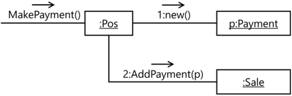

### FIT - Universidad Católica del Uruguay

<br>

# Low Coupling & High Cohesion

## Introducción

En este documento veremos un par más de patrones GRASP<sup>1</sup>. Al igual que el resto de los patrones GRASP y los principios SOLID, estos nuevos patrones ayudan a distribuir los datos y la lógica de los programas de forma razonablemente equilibrada en responsabilidades de hacer y de conocer de las clases y objetos.

Los patrones GRASP fueron planteados por Craig Larman en el libro “Applying UML and Patterns”, de 1998. Tanto los patrones presentados en este documento como el ejemplo que los acompaña están tomados de ese libro, que te recomendamos consultar.

## Low Coupling Pattern

Ana ha venido trabajando con la aplicación de punto de venta que introdujimos en los ejemplos anteriores, y ahora le han pedido que agregue la posibilidad de realizar pagos con un **Pos** pin y verde.

―Voy a definir una clase **Pos** ―piensa Ana― y asignar a esa clase la responsabilidad de realizar pagos. Ana dibuja la
siguiente tarjeta CRC:

<table id="card">
    <tr>
        <td align="center" colspan="2">
            <h3>Pos</h3>
        </td>
    </tr>
    <tr>
        <td>Realizar un Pago</td>
        <td></td>
    </tr>
</table>

La responsabilidad de conocer el monto del pago ―razona Ana― no puede ser de la clase **Sale**, porque una venta se puede cancelar con varios pagos, por ejemplo, parte en efectivo y parte con tarjeta de débito. Entonces introduce una clase **Payment** y dibuja su tarjeta CRC:

<table id="card">
    <tr>
        <td align="center" colspan="2">
            <h3>Paymnet</h3>
        </td>
    </tr>
    <tr>
        <td>Conocer el monto del Pago</td>
        <td></td>
    </tr>
</table>

Luego modifica la tarjeta de la clase **Sale** que ya había, para agregar las responsabilidades de conocer los pagos y de calcular el saldo a pagar<sup>2</sup>:

<table id="card">
    <tr>
        <td align="center" colspan="2">
            <h3>Sale</h3>
        </td>
    </tr>
    <tr>
        <td>
            <p>Conocer fecha y hora</p>
            <p>Conocer una o más líneas de ítemsvendidos</p>
            <p><b>Conocer los pagos</b></p>
            <p>Calcular el total</p>
            <p><b>Calcular el saldo a pagar</b></p>
            <p>Representar la venta como texto a imprimir</p>
        </td>
        <td>
            <p>Sales Line</p>
            <p>Item</p>
            <p><b>Paymnet</b></p>
        </td>
    </tr>
</table>

Luego modifica la tarjeta de la clase **Pos** para agregar las colaboraciones faltantes:

<table id="card">
    <tr>
        <td align="center" colspan="2">
            <h3>Pos</h3>
        </td>
    </tr>
    <tr>
        <td>
            <p>Realizar un pago</p>
        </td>
        <td>
            <p><b>Paymnet</b></p>
            <p><b>Sale</b></p>
        </td>
    </tr>
</table>

Ana programa en C# las nuevas clases **Pos** y **Payment**, y modifica la clase **Sale**<sup>3</sup>:

```c#
public class Pos
{
    public void MakePayment(Sale sale, double ammount)
    {
        Payment payment = new Payment(ammount);
        sale.AddPayment(payment);
    }
}
```

> [Ver en repositorio »](https://github.com/ucudal/PII_LowCouplingHighCohesion/blob/master/v1/Pos.cs)

```c#
public class Payment
{
    public Payment(double ammount)
    {
        this.Ammount = ammount;
    }

    public double Ammount { get; }
}
```

> [Ver en repositorio »](https://github.com/ucudal/PII_LowCouplingHighCohesion/blob/master/v1/Payment.cs)

```diff
public class Sale
{
    …
    private IList<Payment> payments = new List<Payment>();
  
+    public double Paid
+    {
+       get
+       {
+           double result = 0;
+           foreach (Payment payment in this.payments)
+           {
+               result = result + payment.Ammount;
+           }
+           return result;
+       }
+   }

    public void AddPayment(Payment payment)
    {
        this.payments.Add(payment);
    }

    public string GetTextToPrint()
    {
        string result = $"Fecha: {this.DateTime}\n";
        foreach (SalesLineItem item in this.lineItems)
        {
            result = result +
            $"{item.Quantity} de '{item.Product.Description}' a ${item.Product.Price}\n";
        }

        result = result + $"Total:\t${this.Total}\n";

+       foreach (Payment payment in this.payments)
+       {
+           result = result + $"Paid:\t${payment.Ammount}\n";
+       }

+       result = result + $"Due:\t${this.Total - this.Paid}";

        return result;
    }
}
```

> [Ver en repositorio »](https://github.com/ucudal/PII_LowCouplingHighCohesion/blob/master/v1/Sale.cs)

El código compila y funciona, pero a Ana le entra la duda si está bien que la clase **Pos** tenga la responsabilidad de crear instancias de **Payment**. Mira a su alrededor y ve a José, que está muy concentrado programando a su lado. Ana confía mucho en los consejos de José, así que no dudó en compartir su duda con él.

―José, ¿te puedo interrumpir? ―pregunta Ana a José.

―Claro Ana, ¿en qué te pudo ayudar?

―Mira ―dice Ana mostrándole las tarjetas CRC que había hecho― no estoy segura de qué clase debería tener la responsabilidad de crear instancias de **Payment**. Usando el patrón Creator ―continuó Ana― asigné esa responsabilidad a la clase **Pos**, porque **Pos** es la clase que recibe los pagos y conoce el monto pagado.

―Te sigo Ana, ¿cuál es tu duda?

―No sé, hay algo que no me gusta ―dice Ana, titubeando―, creo que también podría ser una responsabilidad de **Sale**.

―Es cierto ―dice Jose―, tu intuición te dice que hay algo que no está bien, ¿cierto?

―Tal cual.

―Vení, vamos a dibujar en el pizarrón como es la secuencia de mensajes en cada caso.

José comienza a hacer un esquema en el pizarrón. Ana sabe que a José le encanta dibujar secuencias de mensajes entre objetos para entender cómo interactúan entre ellos, él dibuja los objetos como rectángulos y los mensajes en flechitas que van del emisor al receptor.



―Mirá, así te queda la secuencia de mensajes cuando **Pos** tiene la responsabilidad de crear instancias de **Payment** ―le explica José a Ana―. En el método MakePayment de **Pos** se crea una instancia de **Payment**, que luego se agrega en el mismo método a una instancia de Sale, mandando el mensaje AddPayment con la instancia de **Payment** recién creada como argumento.

―Así fue como lo hice ―dijo Ana.

―Pero hay algo que te hace ruido ¿no?

―Ajá, pero no sé qué es.

―Tenés más dependencias de las que se necesita Ana, eso es lo que te hace ruido; el acoplamiento4 es muy alto ―dice José, enfáticamente.

―¿Acoplamiento? ―pregunta Ana, frunciendo el ceño.

―El acoplamiento es una medida de qué tanto o de qué tan fuertemente una clase está conectada con otra, o depende de la otra. Mira cómo cambia el dibujo cuando la responsabilidad de crear instancias de **Payment** se la das a **Sale** en lugar de a **Pos** ―dice José, y dibuja otro diagrama de secuencia en el pizarrón:


―En este caso ―explica José― en el método MakePayment de **Pos** se delega la creación de la instancia de **Payment**, mediante el envío del mensaje MakePayment a la clase **Sale**, que a su vez crea una nueva instancia de **Payment**.

―¿Y porqué baja el acoplamiento? ―pregunta Ana.

―¿Ves que ahora la clase **Pos** no tiene que conocer a la clase **Payment**? ―pregunta José a Ana―.

―¡Ah!, tenés razón ―dice Ana, con una sonrisa―, antes **Pos** tenía que conocer tanto a Sale como a **Payment**, ¡ahora **Pos** sólo conoce a **Sale**!

―Correcto. El acoplamiento tiene que ser bajo para reducir las posibilidades de que cambios en una clase afecten a la clase dependiente, por ejemplo, cambios en **Payment** afectan ahora sólo a **Sale** pero no a **Pos** ―explica José―. Pero también para favorecer la reutilización, porque ahora puedo usar la clase **Sale** sin saber nada de **Payment**.

―¡Gracias José! ―dice Ana―. Me voy a poner a programar.

Esta es la nueva versión del programa que hace Ana; la clase **Payment** es la misma, sólo hay cambios en **Pos** y en **Sale**.

```diff
public class Pos
{
    public void MakePayment(Sale sale, double ammount)
    {
+        sale.MakePayment(ammount);
    }
}
```

> [Ver en repositorio »](https://github.com/ucudal/PII_LowCouplingHighCohesion/blob/master/v2/Pos.cs)

```diff
public class Sale
{
    …
+   public void MakePayment(double ammount)
+   {
+       Payment payment = new Payment(ammount);
+       this.payments.Add(payment);
+   }
    …
}
```

> [Ver en repositorio »](https://github.com/ucudal/PII_LowCouplingHighCohesion/blob/master/v2/Sale.cs)

### Problema

¿Cómo promover poca dependencia entre clases y aumentar la reutilización?

### Solución

Asignar una responsabilidad de forma que el acoplamiento se mantenga bajo.

El acoplamiento es una medida de qué tanto o de qué tan fuertemente una clase está conectada con otra, o depende de la otra. Una clase con poco acoplamiento o con acoplamiento bajo no depende de muchas otras clases; “muchas otras” depende del contexto, es un concepto relativo. Como regla general, cuánto más bajo el acoplamiento, mejor.
La forma de crear acoplamiento entre clases es cuando una clase depende de la otra:

- Una clase es una subclase de la otra.

- Una clase tiene una variable de instancia o un atributo que es un objeto o una colección de objetos de la otra.

- Una clase tiene un método que retorna o que recibe como argumento un objeto de la otra clase.

- Una clase crea un objeto de la otra clase internamente en un método.


## High Cohesion Pattern

### Problema

¿Cómo mantener manejable la complejidad?

### Solución

> Asignar una responsabilidad de forma que la cohesión se mantenga alta.

En el contexto de la programación orientada a objetos, la cohesión<sup>5</sup> es una medida de qué tan enfocadas y fuertemente relacionadas están las responsabilidades de una clase. Una clase con responsabilidades alta o fuertemente relacionadas tiene alta cohesión. Por el contrario, una clase con baja o poca cohesión hace muchas cosas que no tienen que ver entre sí. Como regla general, cuanto mayor es la cohesión, mejor.

El problema con la baja cohesión es que deriva en clases que son más difíciles de entender, de reutilizar, de mantener, y generalmente son más frágiles.

Podemos analizar la decisión de Ana en el capítulo anterior a la luz del patrón High Cohesion. El primer diseño pone la responsabilidad de crear instancias de **Payment** en **Pos**. Probablemente con una sola responsabilidad no se note la falta de cohesión, pero si agregamos a la clase **Pos** otras responsabilidades de las que es candidata -leer una tarjeta de crédito o de débito, procesar un PIN, comunicarse con el banco, imprimir el voucher, etc. puede ocurrir que se vuelva poco cohesiva.

Por el contrario, el segundo diseño pone la responsabilidad de crear instancias de **Payment** en **Sale**, que ya tiene la responsabilidad de conocer las instancias de **Payment**. Aunque es una nueva responsabilidad, está estrechamente relacionada con responsabilidades que **Sale** ya tenía.

Cohesión y acoplamiento están correlacionados; cuando una mejora el otro empeora, y viceversa, por lo que es necesario mantener un balance adecuado entre las dos:

- Una clase que tiene pocas dependencias de otras clases seguramente está poco acoplada, pero tal vez haga muchas cosas por sí misma que podría delegar, con lo cual probablemente sea poco cohesiva.

- Una clase que hace lo mínimo necesario y delega todo lo demás seguramente es altamente cohesiva porque lo poco que hace está sumamente relacionado, pero probablemente tenga muchas relaciones con otras clases, con lo cual va a estar muy acoplada.

Estos dos patrones, **Low Coupling** y **High Cohesion** son guías para decidir cómo asignar responsabilidades. 

*****

_<sup>1</sup> GRASP: General Responsibility Assignment Patterns._

_<sup>2</sup> Las modificaciones están marcadas con amarillo._

_<sup>3</sup> El código que ya apareció antes en otro documentos se muestra con …; los cambios están marcados con verde._

_<sup>4</sup> https://en.wikipedia.org/wiki/Coupling (computer_programming) ._

_<sup>5</sup> https://en.wikipedia.org/wiki/Cohesion (computer_science) ._