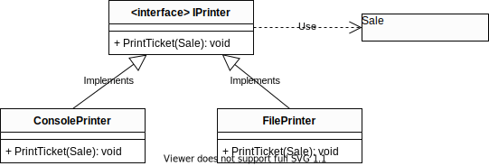

### FIT - Universidad Católica del Uruguay

<br>

# Polymorphism Pattern

Decimos que una operación es polimórfica cuando es implementada por dos o más objetos de diferentes tipos. Relacionado con esto hay un patrón GRASP<sup>1</sup> llamado Polymorfism.

Recuerden que los patrones GRASP fueron planteados por Craig Larmann en el libro “Applying UML and Patterns”, de 1998. Tanto el patrón presentado en el este documento como el ejemplo que lo acompaña están tomados de ese libro, que te recomendamos consultar.

## Problema

¿Cómo manejar alternativas basadas en el tipo? ¿Cómo crear componentes de software conectables?

## Solución

Cuando alternativas o comportamientos relacionados varían según el tipo o clase, asignar las responsabilidades por el comportamiento usando operaciones polimórficas a los tipos cuyo comportamiento varía.

> ⚠️  **Importante**
>
>No pregunten por el tipo de un objeto y usen lógica condicional para ejecutar diferentes fragmentos de código que varían según el tipo.

## Ejemplo

En el ejemplo del punto de venta introducido en [Experto](./Expert.md) y [SRP](./SRP.md), ¿quién debería ser responsable por imprimir el ticket en diferentes destinos por ejemplo una impresora o la consola?

Inicialmente tenemos una clase **AllInOnePrinter** que según el tipo **Destination** imprime en consola o un archivo de texto.

```c#
public enum Destination
{
    Console,
    File
}

public class AllInOnePrinter
{
    public void PrintTicket(Sale sale, Destination destination)
    {
        if (destination == Destination.Console)
        {
            Console.WriteLine(sale.GetTextToPrint());
        }
        else
        {
            File.WriteAllText("Ticket.txt", sale.GetTextToPrint());
        }
    }
}
```
> [Ver en repositorio »](https://github.com/ucudal/PII_Polymorphism_And_LSP/blob/master/v1/src/Library/AllInOnePrinter.cs)
                       
El programa a continuación crea una instancia de la clase **AllInOnePrinter** y le envía el mensaje con selector PrintTicket pasando como parámetro la venta y el destino, **Destination.Console** para imprimir en la consola, y **Destination.File** para imprimir en un archivo.

```c#
public class Program
{
    …
    public static void Main(string[] args)
    {
        PopulateCatalog();
        Sale sale = new Sale();
        …
        AllInOnePrinter printer;
        printer = new AllInOnePrinter();
        printer.PrintTicket(sale, Destination.Console);
        printer.PrintTicket(sale, Destination.File);
    }
    …
}
```
> [Ver en repositorio »](https://github.com/ucudal/PII_Polymorphism_And_LSP/blob/master/v1/src/Program.cs)

Vean que el método PrintTicket de la clase **AllInOnePrinter** tiene un bloque de código para el caso Destination.Console y otro para Destination.File; esto es justamente lo que el patrón Polymorfism dice que no hay que hacer; el código que varía según el destino debería estar en diferentes clases con una operación polimórfica. Para eso definimos un tipo **IPrinter** y dos clases que lo implementan, **ConsolePrinter** y **FilePrinter**; vean el
código a continuación:

```c#
public interface IPrinter
{
    void PrintTicket(Sale sale);
}
```
> [Ver en repositorio »](https://github.com/ucudal/PII_Polymorphism_And_LSP/blob/master/v2/src/Library/IPrinter.cs)

```c#
public class FilePrinter : IPrinter
{
    public void PrintTicket(Sale sale)
    {
        File.WriteAllText("Ticket.txt", sale.GetTextToPrint());
    }
}
```
> [Ver en repositorio »](https://github.com/ucudal/PII_Polymorphism_And_LSP/blob/master/v2/src/Library/FilePrinter.cs)

```c#
public class ConsolePrinter : IPrinter
{
    public void PrintTicket(Sale sale)
    {
        Console.WriteLine(sale.GetTextToPrint());
    }
}
```
> [Ver en repositorio »](https://github.com/ucudal/PII_Polymorphism_And_LSP/blob/master/v2/src/Library/ConsolePrinter.cs)

En el siguiente diagrama UML vemos cómo representar que las clasess `ConsolePrinter` y `FilePrinter` implementan la interfaz `IPrinter`:



El conector entre `ConsolePrinter` e `IPrinter` indica que la clase `ConsolePrinter` **implementa** la interfaz `IPrinter`; es análogo al conector entre `FilePrinter` e `IPrinter`.

El conector entre `IPrinter` y `Sale` indica que la interfaz `IPrinter` depende de la clase `Sale`. Esto es porque la para poder imprimir un ticket cualquier impresora tiene que conocer los detalles del ticket. En el código eso se refleja en la declaración de la operación `void PrintTicket(Sale)` que recibe una instancia de `Sale` como parámetro.

> :warning: Como las clases `ConsolePrinter` y `FilePrinter` implementan la interfaz `IPrinter`, que tiene una **dependencia** con `Sale`, ellas también tienen una dependencia con `Sale`. Esto es porque deben implementar el método `void PrintTicket(Sale)`, y también deben conocer los detalles del ticket para poder imprimirlo.

La nueva versión del programa hace lo mismo que el anterior, sólo que ahora declara dos variables de tipo IPrinter y le asigna a una de ellas una instancia de ConsolePrinter y a la otra una de FilePrinter como aparece a continuación; solo mostramos el código nuevo, los puntos … representan el código que ya apareció antes.

```diff
public class Program
{
    …
    public static void Main(string[] args)
    {
        …
        Sale sale = new Sale();
        …
+       IPrinter printer;
+       printer = new ConsolePrinter();
+       printer.PrintTicket(sale);
+       printer = new FilePrinter();
+       printer.PrintTicket(sale);
    }
    …
}
```
Vean que ahora no estamos preguntando en ningún caso por el destino de la impresión del ticket para cambiar el comportamiento, cada clase de tipo **IPrinter** tiene la responsabilidad de imprimir el ticket con un destino diferente. La operación **PrintTicket** es polimórfica.


*****

_<sup>1</sup> GRASP: General Responsibility ASsignment Patterns._


